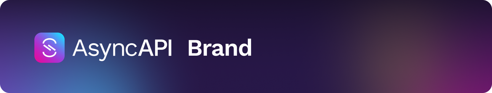

## 🎨 Welcome to the AsyncAPI brand
In this project, we focus on all things related to the creative development of the AsyncAPI brand. The overarching goal for this repo is to provide a space where we can collaborate to define visuals such as logos, colors, typography, iconography, and more! All are welcome to contribute ideas and work where you feel comfortable.

Before you submit your contribution, please read our [Code of Conduct](https://github.com/asyncapi/.github/blob/master/CODE_OF_CONDUCT.md) and [Contribution Guidelines](https://github.com/asyncapi/asyncapi/blob/master/CONTRIBUTING.md#contributing-to-asyncapi).

## ✨ Brand Guidelines
Navigate through our brand guidelines using the links below

- [Logo](brand-guidelines/logo/README.md)
- [Color](brand-guidelines/color/README.md)
- [Typography](brand-guidelines/typography/README.md)
- [Branded Tools](brand-guidelines/branded-tools/README.md)

## 🙌 💡 Ready to contribute?
There are plenty of ways to share your contribution with this project, and you don't have to be a designer to do so! We welcome feedback and work alike in the following areas:

- Logo design/usage
- Brand identity
- Typography
- Brand guidelines
- Iconography
- Mascot ideation/illustration
- Marketing/Social Media design

Issues in this repo are open to all who would like to give feedback and/or provide visual work.

## 🚗 💨 Roadmap
View the chart below to learn about the current goals for the AsyncAPI brand!

|   Status     |                   Goal                     |
| :----: | ------------------------------------------ |
|   In progress    | Brand guidelines |
|   In progress    | Ideate and illustrate mascot to complement new brand style |
|       | Create diverse set of iconography to complement tooling, website, and visual marketing |
|   ✅    | Refresh logos, colors, typography, and establish voice/tone |
|   ✅     | Design marketing campaign for brand roll-out |
 

## Join the discussion 📌
Join the [AsyncAPI Slack workspace](https://asyncapi.com/slack-invite) and the `#12_design` channel to follow all conversations relating to this repo as well as other topics of design.