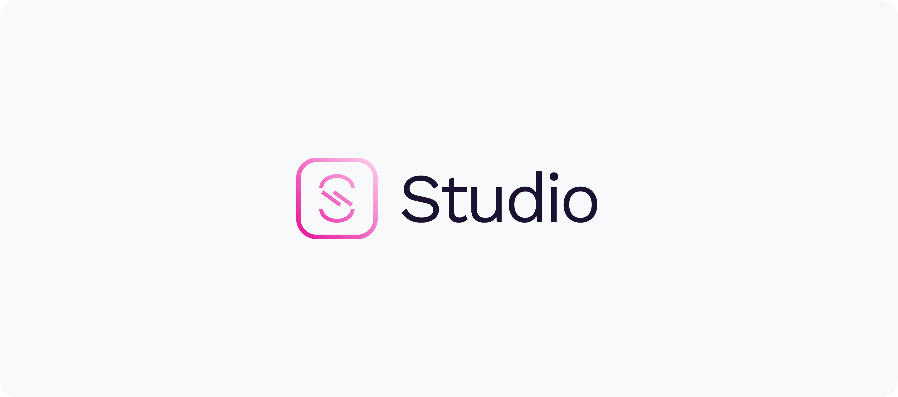

# Tooling logos documentation

Please refer to the following documentation for proper usage of the logos created for AsyncAPI's branded open source tools.

**Table of contents**
- Studio
    - [Studio logo (light)](#studio-logo-light)
    - [Studio logo (dark)](#studio-logo-dark)
    - [Download logo kit for Studio](#download-logo-kit-for-studio)
- Modelina
    - [Modelina logo (light)](#modelina-logo-light)
    - [Modelina logo (dark)](#modelina-logo-dark)
    - [Download logo kit for Modelina](#download-logo-kit-for-modelina)
- Glee
    - [Glee logo (light)](#glee-logo-light)
    - [Glee logo (dark)](#glee-logo-dark)
    - [Download logo kit for Glee](#download-logo-kit-for-glee)
- Parser
    - [Parser logo (light)](#parser-logo-light)
    - [Parser logo (dark)](#parser-logo-dark)
    - [Download logo kit for Parser](#download-logo-kit-for-parser)
- CLI
    - [CLI logo (light)](#cli-logo-light)
    - [CLI logo (dark)](#cli-logo-dark)
    - [Download logo kit for CLI](#download-logo-kit-for-cli)
- Github Actions
    - [Github Actions logo (light)](#github-actions-logo-light)
    - [Github Actions logo (dark)](#github-actions-logo-dark)
    - [Download logo kit for Github Actions](#download-logo-kit-for-github-actions)
- Generator
    - [Generator logo (light)](#generator-logo-light)
    - [Generator logo (dark)](#generator-logo-dark)
    - [Download logo kit for Generator](#download-logo-kit-for-generator)

---

## Studio logo (light)

This version of the logo should be used on dark background interfaces.

| Spec | Details |
| --- | --- |
| Primary color | Studio Pink - `#E50E99` |
| Type color | [`white`](../color/README.md/#base-colors) |
| Background color | [`dark`](../color/README.md/#base-colors) |

## Studio logo (dark)
This version of the logo should be used on light background interfaces.

| Spec | Details |
| --- | --- |
| Primary color | Studio Pink - `#E50E99` |
| Type color | [`dark`](../color/README.md/#base-colors) |
| Background color | [`white`](../color/README.md/#base-colors), [`gray-50`](../color/README.md/#gray-neutrals) |

### **Download logo kit for Studio**

This kit includes both light and dark versions of the logo in PNG and SVG.

[Get them here](./logos/studio/)

---

## Modelina logo (light)

This version of the logo should be used on dark background interfaces.

| Spec | Details |
| --- | --- |
| Primary color | Modelina Cyan - `#02C6F2` |
| Type color | [`white`](../color/README.md/#base-colors) |
| Background color | [`dark`](../color/README.md/#base-colors) |

## Modelina logo (dark)
This version of the logo should be used on light background interfaces.

| Spec | Details |
| --- | --- |
| Primary color | Modelina Cyan - `#02C6F2` |
| Type color | [`dark`](../color/README.md/#base-colors) |
| Background color | [`white`](../color/README.md/#base-colors), [`gray-50`](../color/README.md/#gray-neutrals) |

### **Download logo kit for Modelina**
This kit includes both light and dark versions of the logo in PNG and SVG.

[Get them here](./logos/modelina/)

---

## Glee logo (light)
This version of the logo should be used on dark background interfaces.

| Spec | Details |
| --- | --- |
| Primary color | Glee Green - `#25D04A` |
| Type color | [`white`](../color/README.md/#base-colors) |
| Background color | [`dark`](../color/README.md/#base-colors) |

## Glee logo (dark)
This version of the logo should be used on light background interfaces.

| Spec | Details |
| --- | --- |
| Primary color | Glee Green - `#25D04A` |
| Type color | [`dark`](../color/README.md/#base-colors) |
| Background color | [`white`](../color/README.md/#base-colors), [`gray-50`](../color/README.md/#gray-neutrals) |

### **Download logo kit for Glee**
This kit includes both light and dark versions of the logo in PNG and SVG.

[Get them here](./logos/glee/)

---

## Parser logo (light)
This version of the logo should be used on dark background interfaces.

| Spec | Details |
| --- | --- |
| Primary color | Parser Yellow - `#FFD23F` |
| Type color | [`white`](../color/README.md/#base-colors) |
| Background color | [`dark`](../color/README.md/#base-colors) |

## Parser logo (dark)
This version of the logo should be used on light background interfaces.

| Spec | Details |
| --- | --- |
| Primary color | Parser Yellow - `#FFD23F` |
| Type color | [`dark`](../color/README.md/#base-colors) |
| Background color | [`white`](../color/README.md/#base-colors), [`gray-50`](../color/README.md/#gray-neutrals) |

### **Download logo kit for Parser**
This kit includes both light and dark versions of the logo in PNG and SVG.

[Get them here](./logos/parser/)

---

## CLI logo (light)
This version of the logo should be used on dark background interfaces.

| Spec | Details |
| --- | --- |
| Primary color | CLI Purple - `#875AE2` |
| Type color | [`white`](../color/README.md/#base-colors) |
| Background color | [`dark`](../color/README.md/#base-colors) |

## CLI logo (dark)
This version of the logo should be used on light background interfaces.

| Spec | Details |
| --- | --- |
| Primary color | CLI Purple - `#875AE2` |
| Type color | [`dark`](../color/README.md/#base-colors) |
| Background color | [`white`](../color/README.md/#base-colors), [`gray-50`](../color/README.md/#gray-neutrals) |

### **Download logo kit for CLI**
This kit includes both light and dark versions of the logo in PNG and SVG.

[Get them here](./logos/cli/)

---

## Github Actions logo (light)
This version of the logo should be used on dark background interfaces.

| Spec | Details |
| --- | --- |
| Primary color | Github Actions Blue - `#0D3CD7` |
| Type color | [`white`](../color/README.md/#base-colors) |
| Background color | [`dark`](../color/README.md/#base-colors) |

## Github Actions logo (dark)
This version of the logo should be used on light background interfaces.

| Spec | Details |
| --- | --- |
| Primary color | Github Actions Blue - `#0D3CD7` |
| Type color | [`dark`](../color/README.md/#base-colors) |
| Background color | [`white`](../color/README.md/#base-colors), [`gray-50`](../color/README.md/#gray-neutrals) |

### **Download logo kit for Github Actions**
This kit includes both light and dark versions of the logo in PNG and SVG.

[Get them here](./logos/github-actions/)

---

## Generator logo (light)
This version of the logo should be used on dark background interfaces.

| Spec | Details |
| --- | --- |
| Primary color | Generator Orange - `#F84D04` |
| Type color | [`white`](../color/README.md/#base-colors) |
| Background color | [`dark`](../color/README.md/#base-colors) |

## Generator logo (dark)
This version of the logo should be used on light background interfaces.

| Spec | Details |
| --- | --- |
| Primary color | Generator Orange - `#F84D04` |
| Type color | [`dark`](../color/README.md/#base-colors) |
| Background color | [`white`](../color/README.md/#base-colors), [`gray-50`](../color/README.md/#gray-neutrals) |

### **Download logo kit for Generator**
This kit includes both light and dark versions of the logo in PNG and SVG.

[Get them here](./logos/generator/)

