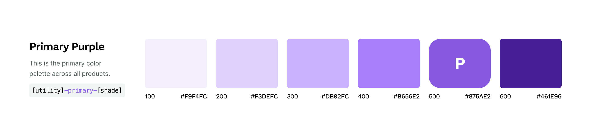
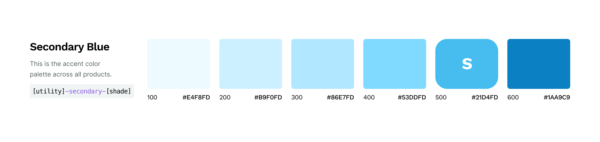
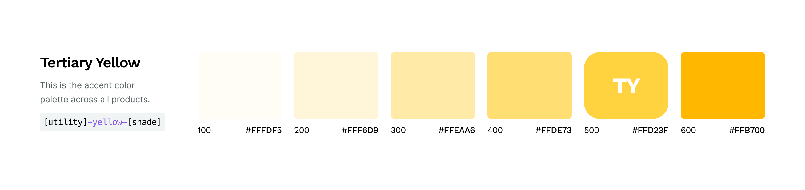
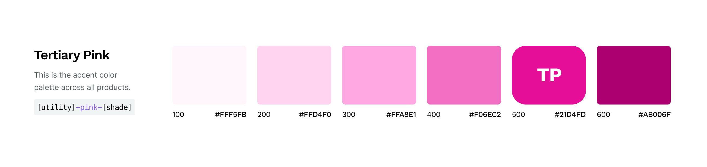
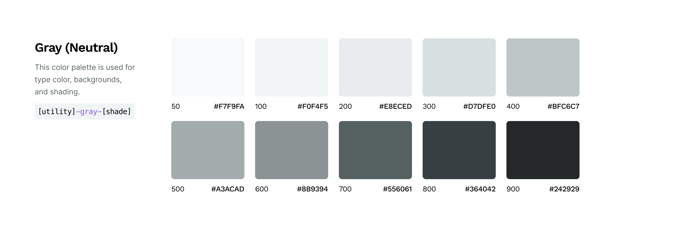
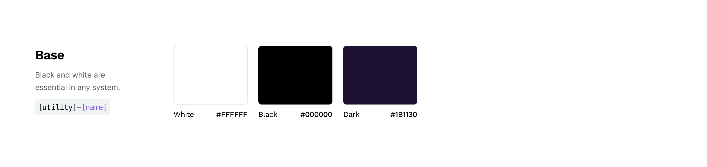
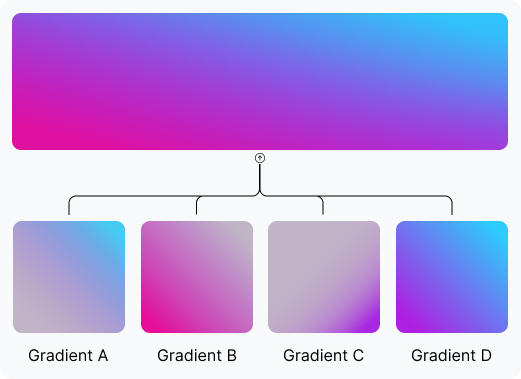
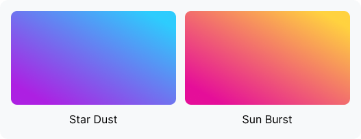

# Color documentation and usage guidelines

Use this documentation as a guide to proper usage of the AsyncAPI colors.

**Table of Contents**
- [Primary Purple](#primary-purple)
- [Secondary Blue](#secondary-blue)
- [Tertiary Yellow](#tertiary-yellow)
- [Tertiary Pink](#tertiary-pink)
- [Gray (neutrals)](#gray-neutrals)
- [Base colors](#base-colors)
- [Gradients](#gradients)

---

## Primary Purple

Our brand’s primary color represents our desire for innovation.

| Shade Name | Hex Code |
| --- | --- |
| `primary-600` | #461E96 |
| `primary-500` | #875AE2 |
| `primary-400` | #A87EFC |
| `primary-300` | #CAB0FC |
| `primary-200` | #E0D1FC |
| `primary-100` | #F4EFFC |

---

## Secondary Blue

This secondary color promotes the importance of trust and transparency.

| Shade Name | Hex Code |
| --- | --- |
| `secondary-600` | #0B81C3 |
| `secondary-500` | #47BCEE |
| `secondary-400` | #80D9FF |
| `secondary-300` | #B2E8FF |
| `secondary-200` | #CCF0FF |
| `secondary-100` | #EDFAFF |

---

## Tertiary Yellow

The tertiary yellow will serve to complement the main colors.

| Shade Name | Hex Code |
| --- | --- |
| `yellow-600` | #FFB700 |
| `yellow-500` | #FFD23F |
| `yellow-400` | #FFDE73 |
| `yellow-300` | #FFEAA6 |
| `yellow-200` | #FFF6D9 |
| `yellow-100` | #FFFDF5 |

---

## Tertiary Pink

The tertiary pink will serve to complement the main colors.

| Shade Name | Hex Code |
| --- | --- |
| `pink-600` | #AB006F |
| `pink-500` | #E50E99 |
| `pink-400` | #F06EC2 |
| `pink-300` | #FFA8E1 |
| `pink-200` | #FFD4F0 |
| `pink-100` | #FFF5FB |

---

## Gray (neutrals)

This color palette is used for text color, backgrounds, shadows, borders, and shading.

| Shade Name | Hex Code |
| --- | --- |
| `gray-900` | #242929 |
| `gray-800` | #364042 |
| `gray-700` | #556061 |
| `gray-600` | #8B9394 |
| `gray-500` | #A3ACAD |
| `gray-400` | #BFC6C7 |
| `gray-300` | #D7DFE0 |
| `gray-200` | #E8ECED |
| `gray-100` | #F0F4F5 |
| `gray-50` | #F7F9FA |

---

## Base colors

These basic colors are included for text colors and backgrounds.

| Shade Name | Hex Code |
| --- | --- |
| `white` | #FFFFFF |
| `black` | #000000 |
| `dark` | #1B1130 |

---

## Gradients

See below for gradients that are used in AsyncAPI branding.

### Main gradient

The main gradient is made up of 4 layers of gradients. See the specs listed below.

|   |   |
|---|---|
| Gradient A | `linear-gradient(225deg, rgba(39, 205, 252, 0.81) 9.36%, rgba(78, 156, 244, 0.7) 25.42%, rgba(110, 115, 238, 0.49) 43.35%, rgba(135, 83, 233, 0.32) 57.58%, rgba(153, 60, 229, 0.2) 70.23%, rgba(164, 46, 227, 0.13) 80.51%, rgba(168, 41, 226, 0.1) 88.42%), #C4C4C4;` |
| Gradient B | `linear-gradient(45deg, #E50E99 9.36%, rgba(168, 41, 226, 0.1) 88.42%), #C4C4C4;` |
| Gradient C | `linear-gradient(315deg, #A829E2 9.36%, rgba(168, 41, 226, 0.84) 13.31%, rgba(168, 41, 226, 0.67) 18.05%, rgba(168, 41, 226, 0.51) 23.59%, rgba(168, 41, 226, 0.38) 29.12%, rgba(168, 41, 226, 0.28) 35.45%, rgba(168, 41, 226, 0.2) 43.35%, rgba(168, 41, 226, 0.14) 52.05%, rgba(168, 41, 226, 0.11) 63.12%, rgba(168, 41, 226, 0.1) 88.42%), #C4C4C4;` |
| Gradient D | `linear-gradient(225deg, #2DCCFD 9.35%, #AD20E2 88.41%);` |

### Supplemental gradients

The following shown are two other gradients that comply with AsyncAPI branding. These might be applied to shapes in blurred backgrounds, used as button background colors, or used as a background or accent for marketing purposes.

|     |     |
| --- | --- |
| Star Dust | `linear-gradient(225deg, #2DCCFD 9.35%, #AD20E2 88.41%);` |
| Sun Burst | `linear-gradient(225deg, #FFD23F 9.35%, #E50E99 88.41%);` |