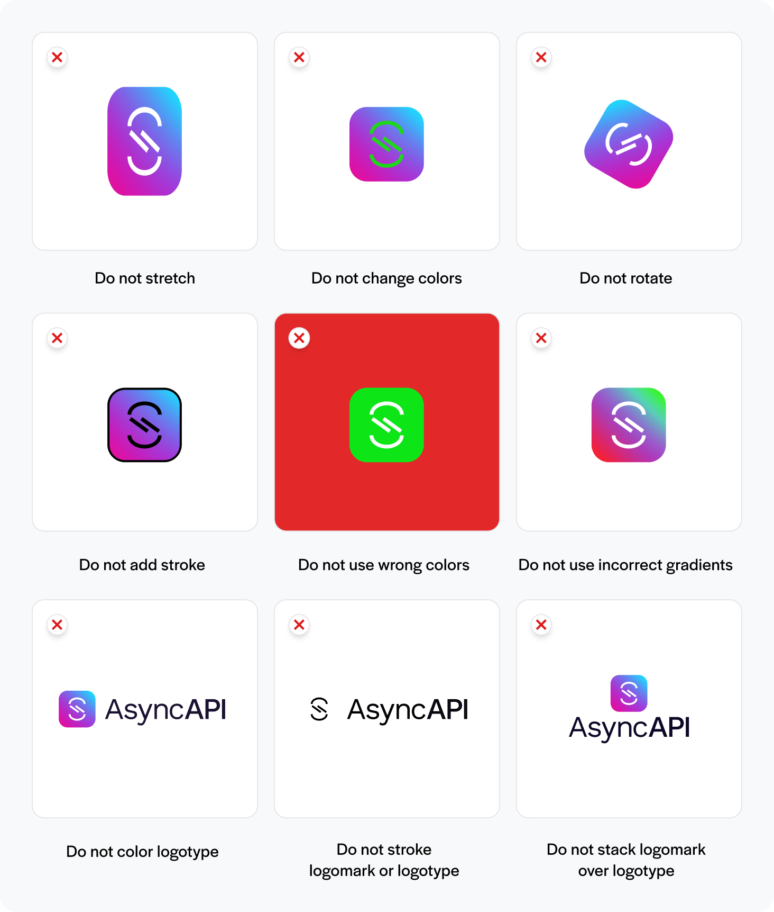

# Logo documentation and usage guidelines
Use this documentation as a guide to proper usage of the AsyncAPI logos.

**Table of Contents**
* [Download logo kit](#download-logo-kit)
* [General logo usage](#general-logo-usage)
    - [Primary logo (dark)](#primary-logo-dark)
    - [Primary logo (light)](#primary-logo-light)
    - [Outline logo (dark)](#outline-logo-dark)
    - [Outline logo (white)](#outline-logo-white)
    - [White logo](#white-logo)
    - [Brand mark & usage](#brand-mark--usage)
* [Clear space](#clear-space)
* [Logo don'ts](#logo-donts)

---

## Download Logo Kit
You can download all AsyncAPI logos from the [/logos/asyncapi](/logos/asyncapi/) directory of this repo. Please refer to the guidelines below for proper usage of the logos in your project.

## General logo usage
See the chart below for the recommended usage of all styles of the AsyncAPI logo.

| Usage | Description |
| --- | --- |
| Minimum width (height to scale) | 190px |
| Minimum height (width to scale) | 42px |
| Minimum padding (space around logo) | 20px | 1.25rem |

---

### Primary logo (dark)
For use on light mode interfaces or light backgrounds.

| Spec | Description |
| --- | --- |
| Background color(s) | [`white`](../color/README.md/#base-colors) / [`gray-50`](../color/README.md/#gray-neutrals) |
| Logo type color | [`dark`](../color/README.md/#base-colors) |
| Logo mark style | Gradient |
| Download | [SVG](/logos/asyncapi/full-logo/primary/dark/SVG/asyncapi-logo--primary-dark.svg), [PNG](/logos/asyncapi/full-logo/primary/dark/PNG/asyncapi-logo--primary-dark.png), [EPS](/logos/asyncapi/full-logo/primary/dark/EPS/asyncapi-logo--primary-dark_RGB.eps) |

---

### Primary logo (light)
For use on dark mode interfaces or dark backgrounds.

| Spec | Description |
| --- | --- |
| Background color(s) | [`dark`](../color/README.md/#base-colors) |
| Logo type color | [`white`](../color/README.md/#base-colors) |
| Logo mark style | Gradient |
| Download | [SVG](/logos/asyncapi/full-logo/primary/light/SVG/asyncapi-logo--primary-light.svg), [PNG](/logos/asyncapi/full-logo/primary/light/PNG/asyncapi-logo--primary-light.png), [EPS](/logos/asyncapi/full-logo/primary/light/EPS/asyncapi-logo--primary-light_RGB.eps) |

---

### Outline logo (dark)
Alternative one-color logo version. For print use when we can only print with one color.

| Spec | Description |
| --- | --- |
| Background color(s) | [`white`](../color/README.md/#base-colors) / [`gray-50`](../color/README.md/#gray-neutrals), Any light-colored garment |
| Logo type color | [`dark`](../color/README.md/#base-colors) |
| Logo mark style | Outline |
| Download | [SVG](/logos/asyncapi/full-logo/outline/dark/SVG/asyncapi-logo--outline-dark.svg), [PNG](/logos/asyncapi/full-logo/outline/dark/PNG/asyncapi-logo--outline-dark.png), [EPS](/logos/asyncapi/full-logo/outline/dark/EPS/asyncapi-logo--outline-dark_RGB.eps) |

---

### Outline logo (white)
Alternative one-color logo version. For print use when we can only print with one color.

| Spec | Description |
| --- | --- |
| Background color(s) | [`dark`](../color/README.md/#base-colors), Any dark-colored garment |
| Logo type color | [`white`](../color/README.md/#base-colors) |
| Logo mark style | Outline |
| Download | [SVG](/logos/asyncapi/full-logo/outline/light/SVG/asyncapi-logo--outline-light.svg), [PNG](/logos/asyncapi/full-logo/outline/light/PNG/asyncapi-logo--outline-light.png), [EPS](/logos/asyncapi/full-logo/outline/light/EPS/asyncapi-logo--outline-light_RGB.eps) |

---

### White logo
Alternative logo for use on gradient backgrounds and patterned/textured backgrounds.

| Spec | Description |
| --- | --- |
| Background color(s) | [Main Gradient](../color/README.md/#main-gradient), Patterns/Textures |
| Logo type color | [`white`](../color/README.md/#base-colors) |
| Logo mark style | Fill (white) |
| Download | [SVG](/logos/asyncapi/full-logo/white/SVG/asyncapi-logo--white.svg), [PNG](/logos/asyncapi/full-logo/white/PNG/asyncapi-logo--white.png), [EPS](/logos/asyncapi/full-logo/white/EPS/asyncapi-logo--white_RGB.eps) |

---

### Brand mark & usage
The brand mark may be used alone without the logotype ("AsyncAPI") as long as AsyncAPI is referenced in some supporting copy/content. Please also see the [Logo don'ts](#logo-donts) and [Clear space](#clear-space) sections for proper usage of the mark.

#### Primary mark
- [Download SVG](/logos/asyncapi/mark/primary/SVG/asyncapi-logo-mark--primary.svg) (Vector-based web use)
- [Download PNG](/logos/asyncapi/mark/primary/PNG/asyncapi-logo-mark--primary.png) (Pixel-based web use)
- [Download EPS](/logos/asyncapi/mark/primary/EPS/asyncapi-logo-mark--primary_RGB.eps) (Vector-based artwork use)

#### White mark
- [Download SVG](/logos/asyncapi/mark/white/SVG/asyncapi-logo-mark--white.svg) (Vector-based web use)
- [Download PNG](/logos/asyncapi/mark/white/PNG/asyncapi-logo-mark--white_RGB.png) (Pixel-based web use)
- [Download EPS](/logos/asyncapi/mark/white/EPS/asyncapi-logo-mark--white_RGB.eps) (Vector-based artwork use)

#### Outline mark - dark
- [Download SVG](/logos/asyncapi/mark/outline/dark/SVG/asyncapi-logo-mark--outline-dark.svg) (Vector-based web use)
- [Download PNG](/logos/asyncapi/mark/outline/dark/PNG/asyncapi-logo-mark--outline-dark.png) (Pixel-based web use)
- [Download EPS](/logos/asyncapi/mark/outline/dark/EPS/asyncapi-logo-mark--outline-dark_RGB.eps) (Vector-based artwork use)

#### Outline mark - light
- [Download SVG](/logos/asyncapi/mark/outline/light/SVG/asyncapi-logo-mark--outline-light.svg) (Vector-based web use)
- [Download PNG](/logos/asyncapi/mark/outline/light/PNG/asyncapi-logo-mark--outline-light.png) (Pixel-based web use)
- [Download EPS](/logos/asyncapi/mark/outline/light/EPS/asyncapi-logo-mark--outline-light_RGB.eps) (Vector-based artwork use)

---

## Clear space
**Clear space** in this context means the minimum space required surrounding the AsyncAPI logo when it is placed near edges or other elements. The graphic below shows how the clear space is generated. The width of the AsyncAPI “S” mark within the logo is used to determine how much clear space is needed. When scaling the logo up and down, you must always use the new size of the “S” as a guide to how much clear space you will need in that specific implementation.

## Logo don'ts
Please use the examples below to understand what NOT to do when using the logo in your application/marketing.

---

[<-- Back to Brand Guidelines home](/brand-guidelines/README.md)