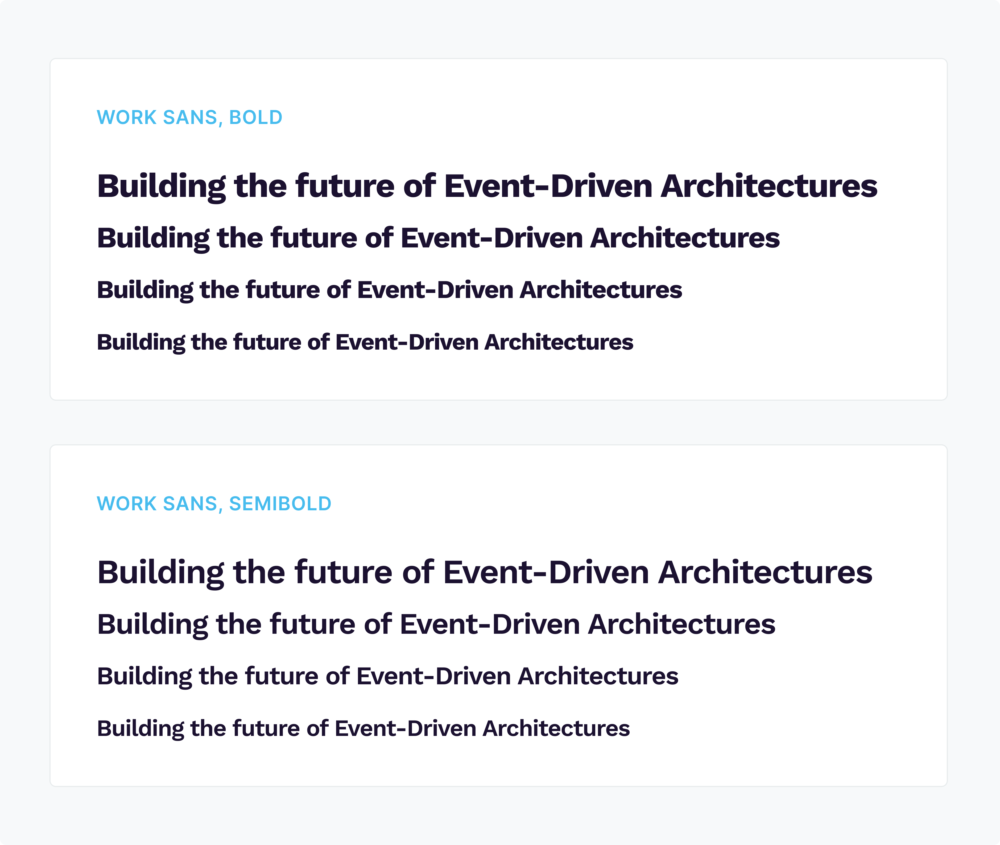
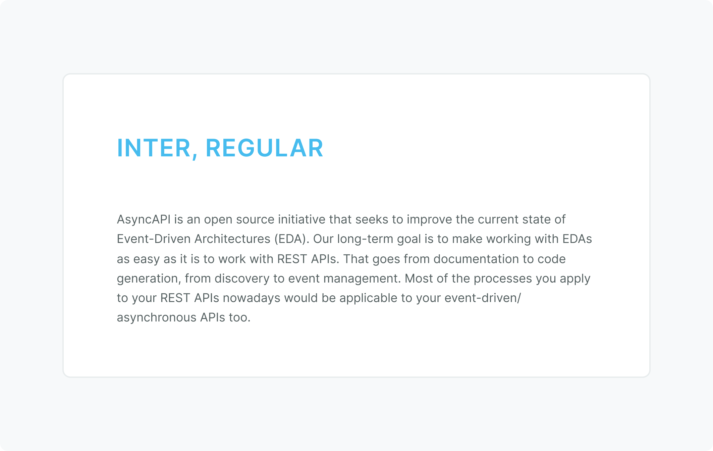
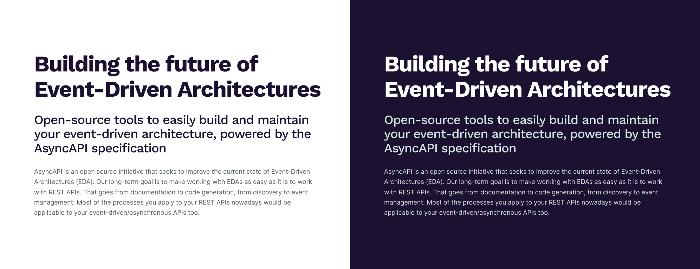

# Typography documentation and usage guidelines
Use this documentation as a guide to proper usage of the AsyncAPI typography.

**Table of contents**
- [Headings](#headings)
- [Body copy (paragraphs)](#body-copy-paragraphs)
- [Type pairings](#type-pairings)

---

## Headings
Headings are used for bold statements that we don’t want anyone to miss. Our heading size scale uses pixel sizes in multiples of 4. Follow the spec guide below to make sure your headings match AsyncAPI branding at any size.

| Spec | Details |
| --- | --- |
| `font-family` | “Work Sans”, sans-serif |
| `font-weight` | `700` (Bold), `600`(SemiBold) |
| `color` (default) | `dark` |
| `letter-spacing` | -0.03em |
| `line-height` | 1.125em |

---

## Body copy (paragraphs)
Use the following specs for body copy text at any scale.

| Spec | Details |
| --- | --- |
| `font-family` | "Inter”, sans-serif |
| `font-size` | > 14px |
| `font-weight` | `400` (Regular) |
| `color` (default) | `gray-700` |
| `letter-spacing` | -0.01em |
| `line-height` | 1.625em |

---

## Type pairings
Below is an example of how blocks of how headings, subheadings and paragraph text might be paired or grouped with one another.

*Please note: the image above does not represent the text at actual size and will resize with the browser width.

The following lists the specs for the above typography pairing:

### Heading specs
| Spec | Details |
| --- | --- |
| `font-size` | 64px |
| `color` (light background) | `dark` |
| `color` (dark background) | `white` |

### Subheading specs
| Spec | Details |
| --- | --- |
| `font-size` | 36px |
| `color` (light background) | `dark` |
| `color` (dark background) | `gray-300` |

### Paragraph specs
| Spec | Details |
| --- | --- |
| `font-size` | 18px |
| `color` (light background) | `gray-700` |
| `color` (dark background) | `gray-300` |

---

[<-- Back to Brand Guidelines home](/brand-guidelines/README.md)