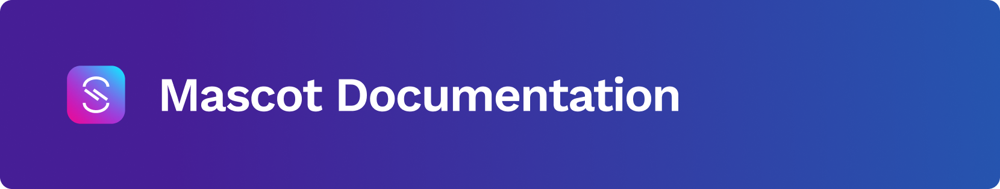
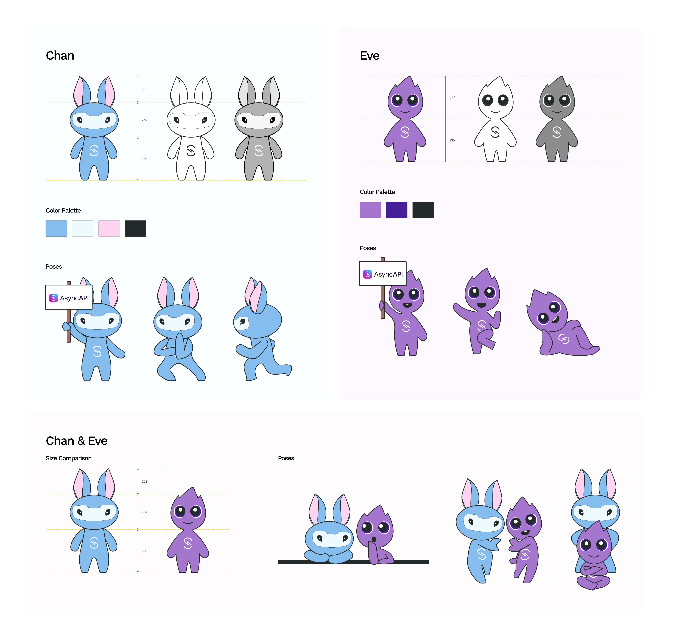
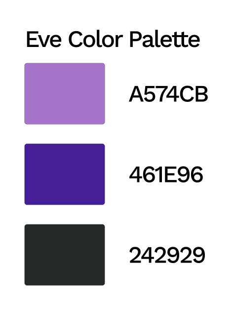
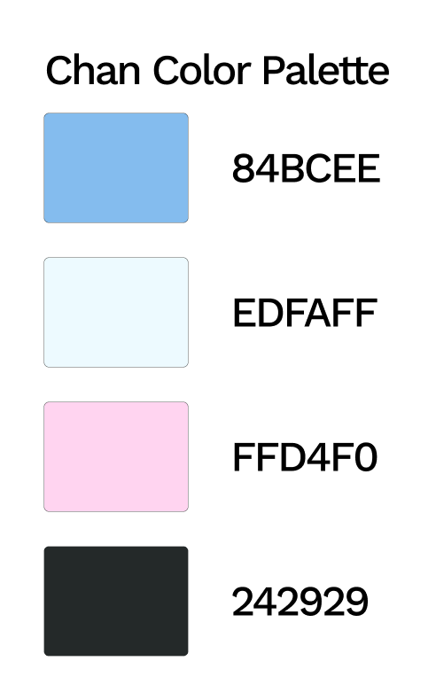

# AsyncAPI Mascot Redesign Documentation  

## 1. Introduction
Chan and Eve are the official AsyncAPI mascots. They are designed to be friendly, expressive, and representative of the AsyncAPI community. They were originally designed with a lot of intricate details. While the concept was great, we wanted to simplify their illustrative details, and make them more versatile and easier to use across different formats. The goal was to create characters using basic shapes, with fewer curves and minimal shading, resulting in a cleaner and more adaptable design.
Their new look is simplified yet maintains their personality, making them easier to integrate into different materials and branding.

**Former design**

**New design**

## 2. Design Concept
Chan is a friendly, agile, and expressive mascot that embodies AsyncAPI’s efficiency. It has a sturdy, minimal design, paired with large, attentive ears that symbolize seamless communication and rapid data exchange—just like asynchronous APIs.
Eve, on the other hand, has a more fluid and warm design, which reflects the dynamic nature of events. Eve’s wide, expressive eyes represent how events are observed, processed, and responded to in an event-driven system.
Together, Chan and Eve illustrate the synergy between channels (the stable infrastructure for communication) and events (the active, responsive elements driving interactions), and visually reinforce the core principles of AsyncAPI.

## 3. Color Palette
Chan and Eve come with a defined, but flexible, color palette. The colors can be adjusted to fit different settings or branding needs while preserving their core identity. They can be adapted to light or dark themes, ensuring the mascots remain recognizable and consistent.

To maintain design integrity while modifying colors:
- Ensure contrast remains accessible.
- Keep the primary color distinct for easy identification.
- Avoid altering the character’s base tone too drastically.
## 4. Poses
- Neutral Poses: Default standing, forward facing position.
- Expressive Poses: Waving, pointing, reacting, holding signs.
- Interactive Poses: Interacting with each other.
Future contributors looking to design additional poses should:
- Maintain the same character proportions.
- Keep expressions simple yet distinct.
- Ensure new poses match the existing style (line thickness, shapes, color palette, etc, should be consistent with the original design).
- Use clear and readable gestures that translate well across various contexts.
## 5. Size & Proportions
Chan and Eve are designed to work together visually, maintaining a balanced size relationship. Their proportions ensure they remain clear and distinct at different scales, whether used individually or as a pair.
For consistency:
- Maintain aspect ratios when resizing.
- Keep key features (eyes, ears, body shape) proportional across all variations.
## 6. Usage
The mascots are designed to be used across different AsyncAPI materials, including:
- Documentation: To guide users through AsyncAPI content.
- Marketing & Branding: In promotional materials, banners, and social media.
- Community Engagement: Representing AsyncAPI in events, merchandise, and contributor recognitions.
## 7. Acknowledgments & Next Steps
Chan and Eve were designed by [Victoria Nduka](https://github.com/nwanduka) with feedback from the AsyncAPI community. For a detailed overview of the design process, including the initial concept, design iterations, feedback, and the final voting results, please refer to [this GitHub issue](https://github.com/asyncapi/brand/issues/12). This discussion captures all the conversations, decisions, and collaborative efforts that led to the final mascot design.
Future iterations may include additional expressions, animations, or event-specific themes. If you're interested in helping expand the mascot design, don’t hesitate to share your ideas.

👉 [Download Mascot Files Here](../eve-and-chan-new)

👉 [Figma Link](https://www.figma.com/design/tgSuADGYTg8l4OS0Rjf9Hi/AsyncAPI-Designs?node-id=132-392&t=YY3GFH1DxaBqgLK4-4)